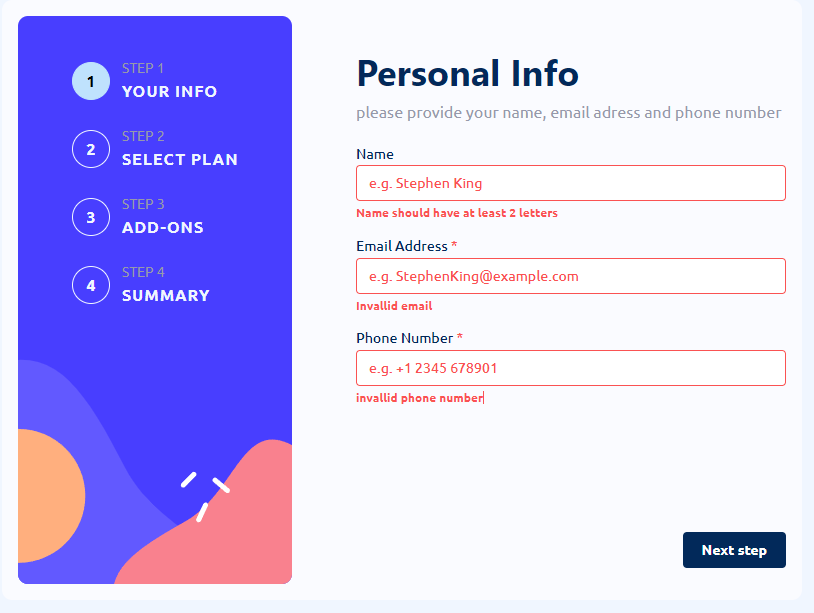

# Frontend Mentor - Multi-step form solution

This is a solution to the [Multi-step form challenge on Frontend Mentor](https://www.frontendmentor.io/challenges/multistep-form-YVAnSdqQBJ). Frontend Mentor challenges help you improve your coding skills by building realistic projects.

## Table of contents

- [Frontend Mentor - Multi-step form solution](#frontend-mentor---multi-step-form-solution)
  - [Table of contents](#table-of-contents)
  - [Overview](#overview)
    - [The challenge](#the-challenge)
    - [Screenshot](#screenshot)
    - [Links](#links)
  - [My process](#my-process)
    - [Built with](#built-with)
  - [Author](#author)

**Note: Delete this note and update the table of contents based on what sections you keep.**

## Overview

### The challenge

Users should be able to:

- Complete each step of the sequence
- See a summary of their selections on the final step and confirm their order
- View the optimal layout for the interface depending on their device's screen size
- See hover and focus states for all interactive elements on the page

### Screenshot

### Links

- Git URL: [My Git](https://github.com/Haiko-E/multistepform-frontendmentor)
- Live Site URL: [My Multistep Form](https://loquacious-axolotl-66c3dd.netlify.app/)

## My process

### Built with

- [Matine](https://mantine.dev/) - Styling, Custom Hooks, Form handeling, Components
- [React](https://reactjs.org/) - JS library
- [Vite](https://styled-components.com/) - builder
- [Zog](https://zod.dev/) Schema validation / typesafe

## Author

Haiko Erinkveld

- Website - [My Portfolio website](https://www.haikoerinkveld.dev)
